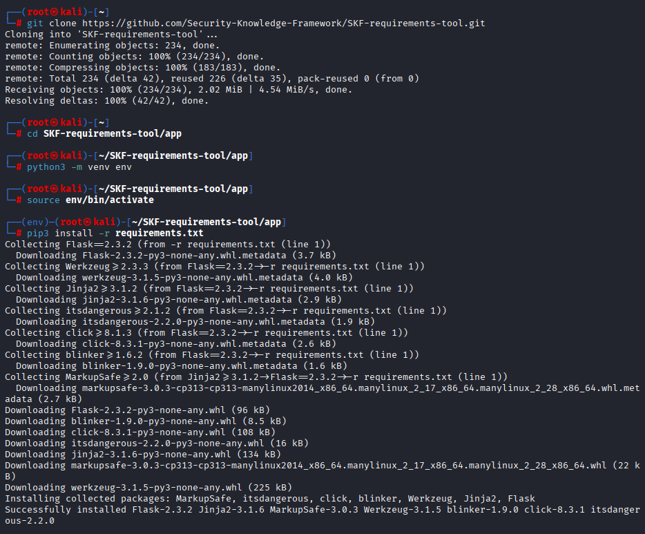
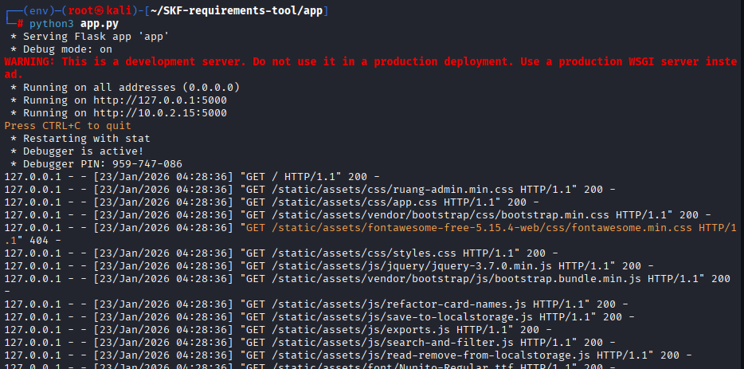
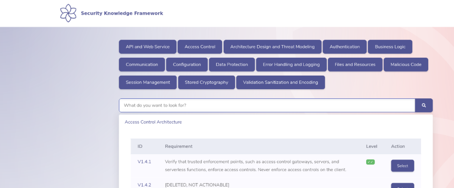
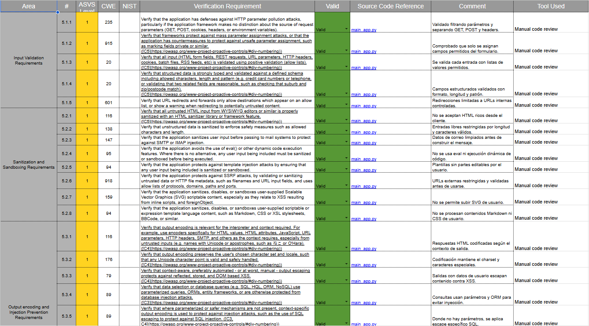
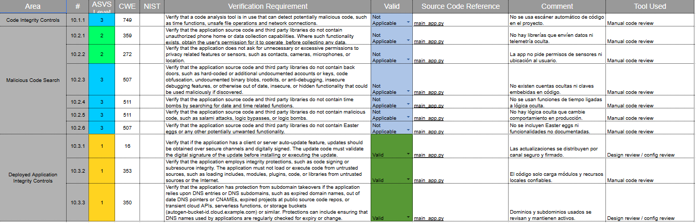
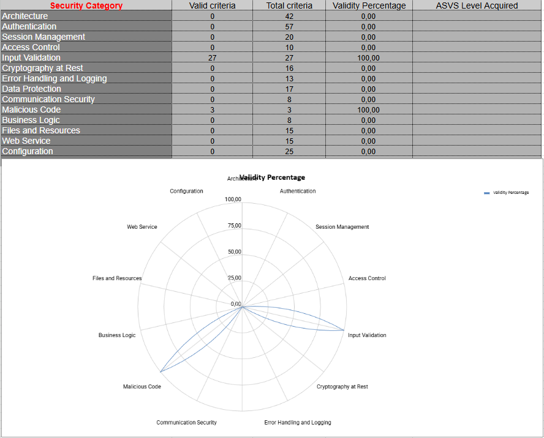

# Puesta en Producción Segura - UT2 - Comprobación de requisitos de seguridad de la aplicación

## 1. Nivel de seguridad requerido

La aplicación desarrollada en la unidad anterior es un programa en Python que se ejecuta en un entorno de laboratorio o clase, sin exposición directa a Internet y con uso académico.
Según OWASP ASVS, el nivel adecuado es el **Nivel 1 (básico)**, orientado a aplicaciones de bajo riesgo o uso interno con datos no críticos.

**Justificación del nivel 1:**

- La aplicación solo se usa en un entorno controlado (aula, laboratorio o máquina local), no en producción real.
- No maneja información crítica de negocio ni datos personales reales, solo datos de ejemplo y pruebas.
- No está publicada en un dominio público ni accesible a usuarios externos.
- Muchos controles de los niveles 2 y 3 están pensados para aplicaciones con impacto legal o económico alto, lo que no coincide con esta práctica.

## 2. Hoja de cálculo ASVS

Se ha utilizado el checklist oficial de OWASP ASVS en formato hoja de cálculo "OWASP ASVS checklist for audits".

Capítulos rellenados en la hoja de cálculo:

- **Validación de entrada**: requisitos relacionados con la comprobación, limpieza y límites de los datos que recibe la aplicación.
- **Código malicioso**: requisitos para evitar puertas traseras, lógica maliciosa o código oculto en la aplicación.

### Estructura usada en la hoja de cálculo

En la hoja de cálculo se ha seguido la estructura del checklist ASVS:

| Requisito ASVS                        | Valid (Valid/Non-valid/Not applicable) | Source Code Reference | Comment                                                                 |
|--------------------------------------|----------------------------------------|-----------------------|-------------------------------------------------------------------------|
| Ejemplo: V1.x Validación de entrada  | Valid                                  | app.py                | Se valida la entrada antes de procesarla.                              |
| Ejemplo: V1.x Longitud de parámetros | Non-valid                              | app.py                | Falta límite de longitud, habría que añadir validación.               |
| Ejemplo: V10.x Código malicioso      | Not applicable                         | app.py                | No se usan librerías externas con alto riesgo ni funciones ocultas.   |

Solo se han rellenado los requisitos de **validación de entrada** y **código malicioso**, tal y como pide la actividad.

## 3. Evidencias con capturas de pantalla

En la raíz del repositorio se han colocado 6 capturas de pantalla con el siguiente contenido:

### 3.1. Descarga, instalación de requisitos y envenenamiento

- Muestra la parte de descarga del proyecto, instalación de los requisitos necesarios y el proceso de envenenamiento configurado para la práctica.

### 3.2. Ejecución de la aplicación con Python

- Muestra la ejecución de `app.py` con `python3` para levantar la aplicación en el puerto configurado (por ejemplo `localhost:5000`).

### 3.3. Acceso a la aplicación en localhost

- Muestra que la aplicación se abre correctamente desde el navegador accediendo a `http://localhost:5000` y que la página principal se visualiza sin errores.

### 3.4. Visualización de la hoja ASVS (vista general)

- Muestra la hoja de cálculo de ASVS abierta, con la vista general o pestaña de resumen donde se ve parte de los requisitos rellenados.

### 3.5. Validación de entrada en la hoja ASVS

- Muestra la pestaña o zona de la hoja de cálculo con los requisitos de **validación de entrada** rellenados (campos `Valid`, `Source Code Reference`, `Comment`, etc.).

### 3.6. Código malicioso y resumen gráfico

- Muestra la parte de **código malicioso** y/o el gráfico de la hoja (por ejemplo el gráfico de telaraña) donde se ve el nivel de cumplimiento por capítulo.

## 4. Análisis del grado de cobertura

Al completar la hoja de cálculo, la primera pestaña muestra el porcentaje de requisitos cumplidos, no cumplidos y no aplicables para cada capítulo.
En el gráfico de la hoja se aprecia el nivel de madurez de la aplicación en cada área de seguridad evaluada.

**Reflexión sobre la cobertura:**

- En **validación de entrada**, la aplicación cumple varios controles básicos (comprobación de datos y tipos), pero sería recomendable reforzar límites de rango y tamaño para hacerla más robusta si se expusiera a usuarios externos.
- En **código malicioso**, muchos requisitos se marcan como "Not applicable" porque no se usan librerías externas complejas ni funcionalidades avanzadas de sistema que puedan actuar como puerta trasera.
- La hoja ASVS deja claro en qué puntos habría que modificar el código para aumentar el nivel de seguridad si el proyecto creciera.

## 5. Herramientas automáticas de verificación

Se pueden usar herramientas automáticas para apoyar la verificación frente a ASVS.

| Herramienta   | Requisitos que ayuda a verificar                                 | Comentario                                                                 |
|---------------|------------------------------------------------------------------|--------------------------------------------------------------------------|
| Bandit        | Seguridad en código Python: uso de funciones inseguras, llamadas a sistema, problemas de inyección. | Analiza el código fuente y detecta patrones peligrosos.                    |
| OWASP ZAP     | Validación de entrada y vulnerabilidades web (inyecciones, XSS, etc.). | Útil si la aplicación expone endpoints HTTP o una interfaz web.           |
| SonarQube     | Calidad de código y vulnerabilidades de seguridad.              | Incluye reglas que se alinean con muchos requisitos de ASVS.              |

Estas herramientas complementan el checklist y ayudan a encontrar problemas que luego se pueden documentar en la hoja de cálculo.

## 6. Reflexión sobre OWASP ASVS

OWASP ASVS proporciona una lista clara y estructurada de controles de seguridad que se puede usar como referencia para casi cualquier aplicación.
Al estar organizado por capítulos y niveles, permite ajustar el esfuerzo de seguridad al tipo de proyecto y a su riesgo real.

**Valoración personal:**

- En proyectos de aprendizaje es muy útil porque obliga a pensar en seguridad desde el diseño y no solo al final del desarrollo.
- Rellenar los requisitos puede llevar tiempo, pero facilita documentar de forma objetiva qué se cumple y qué no, algo clave de cara a auditorías o revisiones.
- Aplicar ASVS mejora las buenas prácticas de desarrollo seguro y se puede reutilizar la misma metodología en proyectos futuros más complejos.

## 7. Conclusiones

- La aplicación desarrollada en clase encaja en **ASVS Nivel 1** y cumple una parte importante de los requisitos de validación de entrada y código malicioso para ese nivel.
- La hoja de cálculo ASVS y las capturas aportan una evidencia clara y ordenada del análisis de seguridad realizado.
- El proceso ayuda a detectar mejoras concretas para endurecer la aplicación, especialmente si en el futuro se quisiera sacar del entorno de laboratorio.