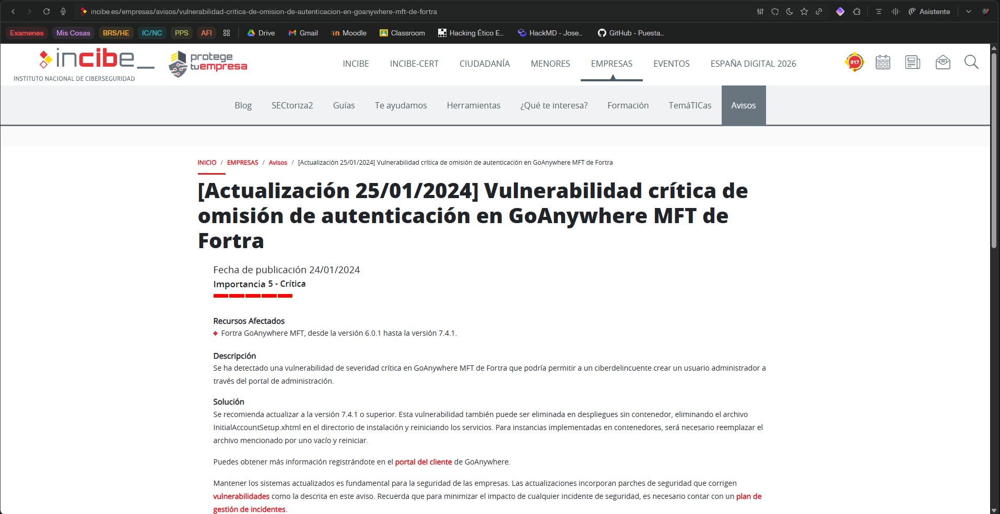
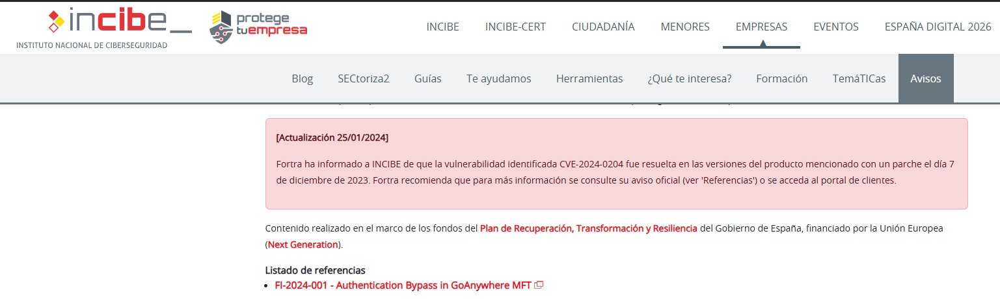
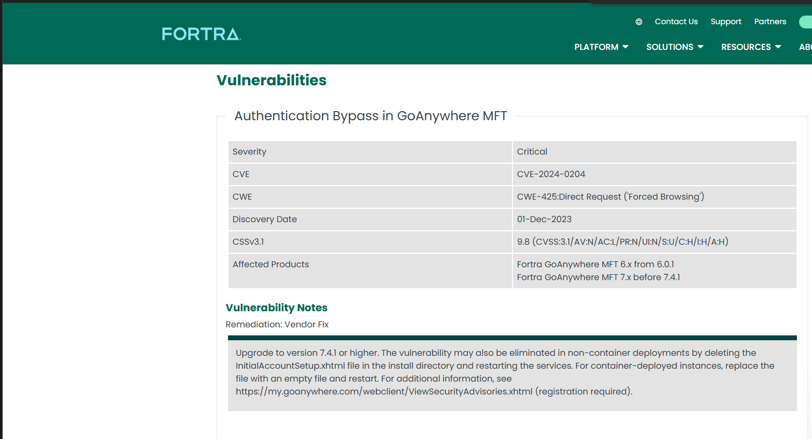
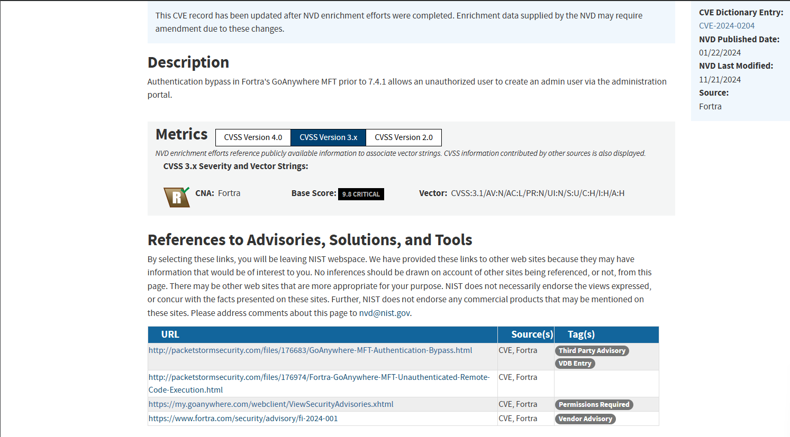
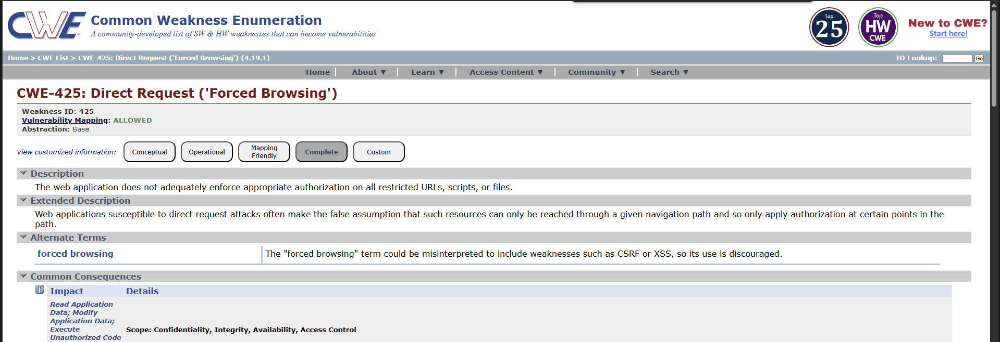
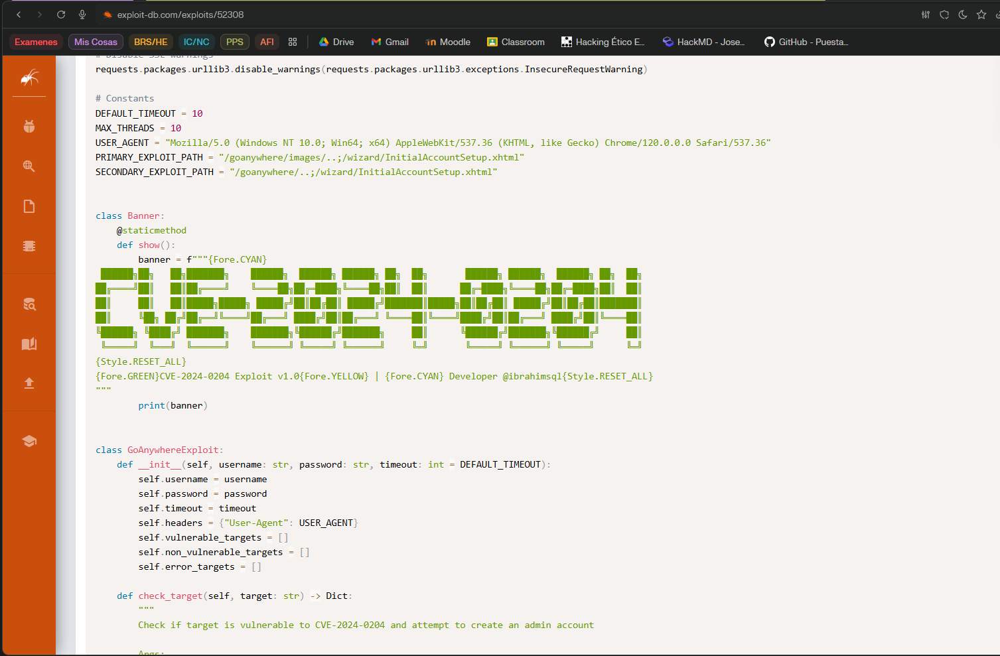
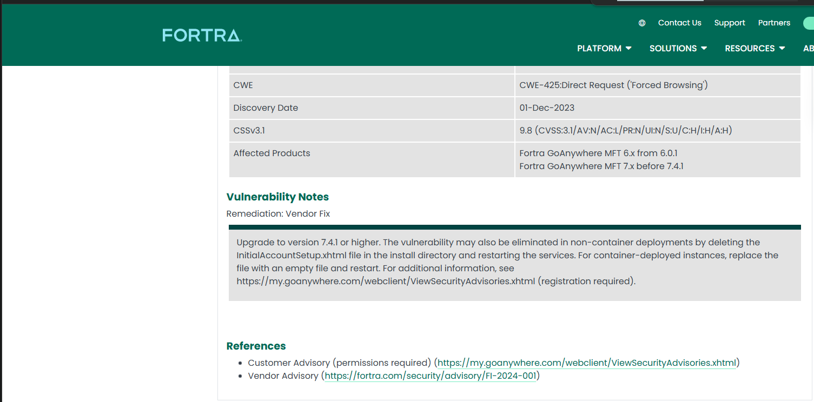

# Trazado de la vulnerabilidad en GoAnywhere MFT (CVE-2024-0204)

## 1. Punto de partida: aviso de INCIBE

- Aviso usado: «Vulnerabilidad crítica de omisión de autenticación en GoAnywhere MFT de Fortra»  
  Fuente: https://www.incibe.es/empresas/avisos/vulnerabilidad-critica-de-omision-de-autenticacion-en-goanywhere-mft-de-fortra  
- Tipo de fallo: omisión de autenticación que permite crear un usuario administrador a través del portal de administración.  
- Productos y versiones afectadas: Fortra GoAnywhere MFT desde la versión 6.0.1 hasta la 7.4.1.  
- Severidad: crítica.  

INCIBE actualiza el aviso indicando que la vulnerabilidad corresponde a **CVE-2024-0204** y que Fortra la corrigió con un parche el 07/12/2023.

---

## 2. Registro en CVE.org (CVE-2024-0204)

- URL consultada: https://www.cve.org/CVERecord?id=CVE-2024-0204  
- Descripción: omisión de autenticación en GoAnywhere MFT previa a la 7.4.1 que permite a un usuario no autenticado crear un usuario administrador vía el portal de administración.  
- Severidad CVSS v3.1: 9.8 (CRITICAL).  
- Debilidad asociada: **CWE-425 – Direct Request ('Forced Browsing')**.  
- Producto: Fortra GoAnywhere MFT, versiones anteriores a 7.4.1.  

Desde la ficha se puede acceder al **CVE Record en JSON** usando el enlace «View JSON», donde aparece la misma información estructurada (descripción, productos, CWE, CVSS, referencias).

> Captura04: vista JSON en CVE.org resaltando descripción, CVSS y CWE.

---

## 3. Registro en NVD (NIST)

- URL consultada: https://nvd.nist.gov/vuln/detail/CVE-2024-0204  
- Descripción: autenticación omitida en GoAnywhere MFT anterior a la 7.4.1 que permite a un usuario no autorizado crear un admin vía el portal de administración.  
- CVSS v3.1: 9.8 (CRITICAL), vector `AV:N/AC:L/PR:N/UI:N/S:U/C:H/I:H/A:H`.  

Interpretación rápida del vector:  
- Ataque remoto por red.  
- Baja complejidad.  
- Sin privilegios previos.  
- Sin interacción del usuario.  
- Impacto alto en confidencialidad, integridad y disponibilidad.

- Weakness: CWE-425 (Direct Request / Forced Browsing).  
- Affected Software (CPE): GoAnywhere MFT < 7.4.1 (distintas plataformas/sistemas).  

---

## 4. Debilidad CWE implicada

- Debilidad indicada: **CWE-425 – Direct Request ('Forced Browsing')**.  
- Significado: acceso directo a recursos (por ejemplo, URLs internas como el asistente de configuración) sin que se apliquen correctamente los controles de autorización.  
- En este caso, el recurso vulnerable es el asistente de **InitialAccountSetup** que permite crear un usuario administrador.  

Para ampliar el significado de CWE‑425 se puede consultar, por ejemplo, la descripción en MITRE: https://cwe.mitre.org/ (buscar CWE‑425) o un análisis técnico de la vulnerabilidad.

---

## 5. Riesgo y explotación

Datos clave de impacto (CVE-2024-0204):  
- Puntuación CVSS v3.1: **9.8 / 10 (CRÍTICA)**.  
- Permite crear un usuario administrador sin autenticación.  
- Vector remoto, sin credenciales y sin interacción del usuario.  

Algunos análisis técnicos detallan que el exploit abusa de la ruta `/wizard/InitialAccountSetup.xhtml` para enviar los parámetros del formulario de creación de cuenta admin sin pasar por los controles de acceso.  
Ejemplos de análisis:

- https://www.horizon3.ai/attack-research/attack-blogs/cve-2024-0204-fortra-goanywhere-mft-authentication-bypass-deep-dive  
- https://www.kroll.com/en/publications/cyber/authentication-bypass-in-fortra-goanywhere-mft  

También existe exploit público en Exploit‑DB:  
- https://www.exploit-db.com/exploits/52308  

---

## 6. Mitigaciones y solución

Según INCIBE y el fabricante:

- **Actualización recomendada**:  
  - Actualizar GoAnywhere MFT a la versión **7.4.1 o superior**.  
    - INCIBE: https://www.incibe.es/empresas/avisos/vulnerabilidad-critica-de-omision-de-autenticacion-en-goanywhere-mft-de-fortra  
    - Fortra: https://www.fortra.com/security/emerging-threats/authentication-bypass-vulnerability-goanywhere-mft  

- **Mitigaciones sobre el fichero vulnerable** (`InitialAccountSetup.xhtml`):  
  - Despliegues sin contenedor: eliminar `InitialAccountSetup.xhtml` y reiniciar servicios.  
  - Despliegues en contenedor: sustituir `InitialAccountSetup.xhtml` por un archivo vacío y reiniciar servicios.  

---

## 7. Resumen del trazado

1. Desde el aviso de INCIBE se identifica la vulnerabilidad crítica en GoAnywhere MFT y su rango de versiones afectadas.  
2. En la actualización del aviso se obtiene el identificador **CVE-2024-0204**.  
3. En **CVE.org** se confirma la descripción, severidad 9.8, debilidad **CWE-425** y se dispone del JSON del CVE Record.  
4. En **NVD** se consultan las métricas CVSS, el software afectado (CPE) y la asociación a CWE-425.  
5. Los recursos técnicos muestran que el vector de explotación es el asistente `InitialAccountSetup.xhtml` accesible sin autenticación.  
6. Finalmente, se documentan las medidas: actualizar a 7.4.1 o superior y eliminar/sustituir `InitialAccountSetup.xhtml` según el tipo de despliegue.

**Autor:** Izan Correa Díaz  
**Fecha:** 29 de enero de 2026  
**Asignatura:** Puesta en Producción Segura - UT2  
**Actividad:** Trazado de la vulnerabilidad en GoAnywhere MFT (CVE-2024-0204)