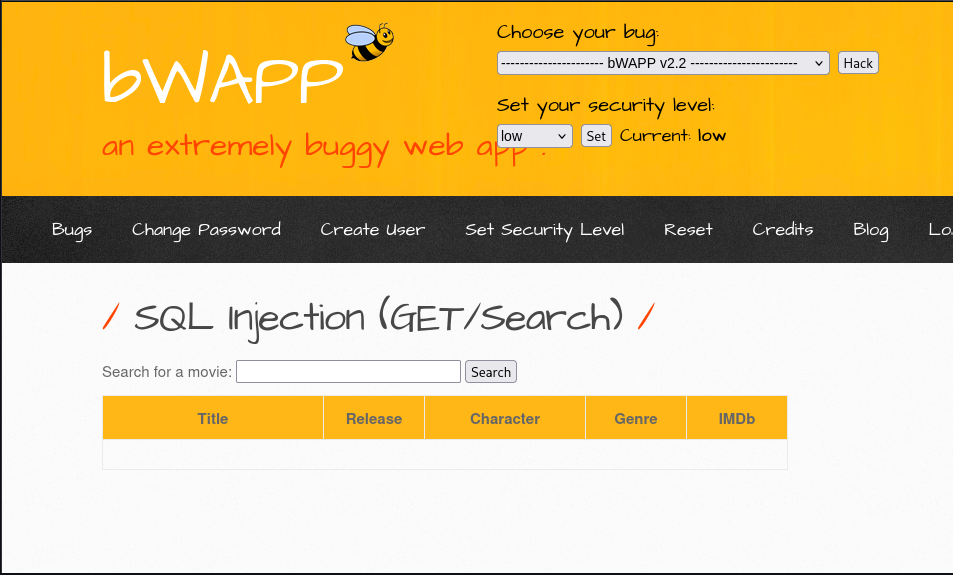
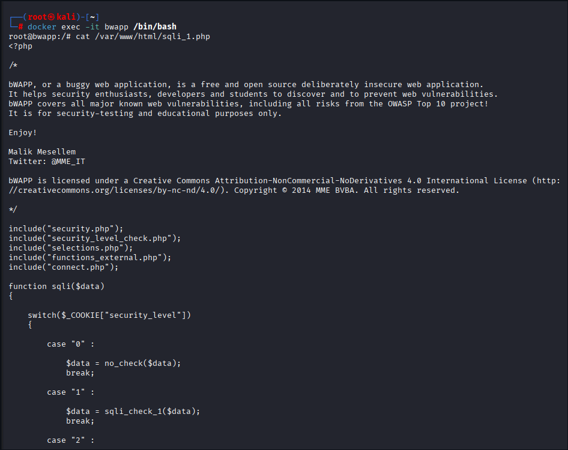

# Máquinas Vulnerables (bWAPP)

En esta actividad se analiza una vulnerabilidad de **Inyección SQL (SQL Injection)** en la aplicación bWAPP desplegada mediante el entorno de máquinas vulnerables indicado por el profesor.

> Nota: Todas las pruebas se han realizado sobre el escenario levantado con `docker compose up -d` utilizando la imagen de bWAPP incluida en el `docker-compose.yml` de la actividad.

---

## 1. Acceso al entorno y selección del caso de SQL Injection

Aquí se mostrará la pantalla principal de bWAPP y la selección del caso concreto de SQL Injection que se va a analizar.

- Captura 1: Pantalla de login de bWAPP y menú de vulnerabilidades de bWAPP con la opción de SQL Injection seleccionada.



---

## 2. Entrada de datos (input) del usuario

En este apartado se explica **cómo llega el dato introducido por el usuario al código PHP** de la aplicación.

Ejemplo de código típico de bWAPP para una vulnerabilidad SQLi:

```php
if (isset($_GET["title"])) {
    $title = $_GET["title"];
}
```

- El parámetro `title` se recibe directamente desde `$_GET`, es decir, es **entrada controlada por el usuario**.
- No se aprecia ninguna validación ni saneamiento previo antes de utilizar este dato en la consulta SQL.



---

## 3. Construcción de la consulta SQL

A continuación, se muestra cómo se construye la consulta SQL utilizando el dato proporcionado por el usuario.

```php
$sql = "SELECT * FROM movies WHERE title LIKE '%" . sqli($title) . "%'";
```

- La consulta se construye **por concatenación de cadenas**, mezclando directamente el input del usuario con el código SQL.
- Esta práctica es insegura y es la base de la vulnerabilidad de **SQL Injection**, ya que permite inyectar fragmentos de SQL dentro del parámetro `title`.

---

## 4. Función intermedia `sqli()` y niveles de seguridad

Antes de usarse en la consulta, el dato pasa por la función `sqli()`, que decide qué tratamiento aplicar según el nivel de seguridad configurado en la cookie `security_level`.

```php
function sqli($data) {
    switch($_COOKIE["security_level"]) {
        case "0":
            $data = no_check($data);
            break;
        case "1":
            $data = sqli_check_1($data);
            break;
        case "2":
            $data = sqli_check_2($data);
            break;
        default:
            $data = no_check($data);
    }
    return $data;
}
```

**Conclusión:**  
El comportamiento frente al input depende completamente del nivel de seguridad, lo que hace que el mismo código pueda ser muy vulnerable (nivel 0) o algo más protegido (niveles 1 y 2), pero sin llegar a ser una mitigación robusta.

---

## 5. Comportamiento según nivel de seguridad

### 5.1 Nivel 0 – Inseguro

```php
$data = no_check($data);
```

- No hay ningún filtrado ni validación.
- El input llega **tal cual** a la consulta SQL.
- Es posible realizar SQL Injection de forma directa (por ejemplo, añadiendo `' OR '1'='1` en el parámetro).

### 5.2 Nivel 1 – Protección débil

```php
$data = sqli_check_1($data);
```

- Se aplican filtros básicos sobre el texto.
- Se bloquean ciertas cadenas, pero se pueden **evadir** con técnicas ligeramente más avanzadas.
- La aplicación sigue sin utilizar consultas preparadas, por lo que es posible seguir explotando la vulnerabilidad.

### 5.3 Nivel 2 – Protección mayor (pero insuficiente)

```php
$data = sqli_check_2($data);
```

- Se aplican controles más estrictos y se filtran más patrones peligrosos.
- Se reducen muchos ataques básicos, pero el enfoque sigue siendo **basado en filtros manuales**, no en un diseño seguro de acceso a datos.
- Sigue sin utilizarse binding de parámetros ni consultas preparadas.

---

## 6. Ejecución final de la consulta y problemas adicionales

Finalmente, la consulta se ejecuta con una función como la siguiente:

```php
$recordset = mysql_query($sql, $link);
```

Problemas detectados:

- Uso de `mysql_query()`, una API antigua y obsoleta.
- No se usan **consultas preparadas** ni parámetros tipados.
- No hay separación clara entre **lógica** y **datos**, todo va por concatenación de strings.
- El control de seguridad se delega solo en funciones de filtrado, en lugar de aplicar un modelo de acceso seguro a la base de datos.

---

## 7. Resumen del análisis de vulnerabilidad

- La aplicación confía en el input del usuario y lo utiliza para construir consultas SQL mediante concatenación de cadenas.
- La seguridad se basa en funciones de filtrado (`no_check`, `sqli_check_1`, `sqli_check_2`) dependientes del nivel de seguridad, en lugar de usar un diseño intrínsecamente más seguro.
- No se utilizan APIs modernas como `mysqli` o `PDO` con **prepared statements**, ni binding de parámetros.
- En un entorno real de producción, este diseño sería **inaceptable** por el alto riesgo de SQL Injection.

---

## 8. Enfoque de Producción Segura (mejoras recomendadas)

En un entorno de producción seguro, el código debería:

- Utilizar **consultas preparadas** con parámetros, evitando concatenar directamente el input en la consulta SQL.
- Validar y sanear el input desde el lado de la aplicación (tipos, longitud, listas blancas, etc.).
- Eliminar el uso de funciones `mysql_*` y migrar a `mysqli` o `PDO`.
- Registrar y monitorizar los intentos de inyección para poder detectar patrones de ataque.
- No depender de un "nivel de seguridad" configurable que pueda dejar la aplicación deliberadamente vulnerable.

---

**Autor:** Izan Correa Díaz  
**Fecha:** 29 de enero de 2026  
**Asignatura:** Puesta en Producción Segura - UT2  
**Actividad:** Máquinas Vulnerables (bWAPP)